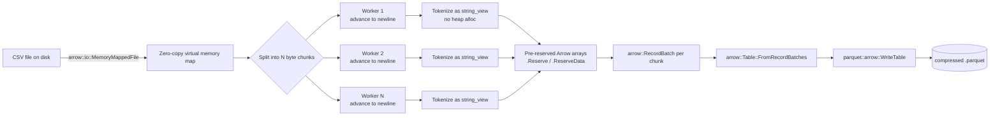

# ⚡ High-Performance Parallel CSV → Parquet ETL Engine

A production-grade **C++17** data-ingestion engine that converts large CSV files into compressed **Apache Parquet**, using OS-level memory mapping and lock-free parallelism to eliminate heap-allocation and thread-contention overhead.


---

## 📊 Performance

Benchmarked against a single-threaded baseline using standard C++ `iostream` I/O, on a multi-million-row financial dataset:

| Phase           | Baseline    | This engine | Speedup   |
|-----------------|-------------|-------------|-----------|
| Parsing         | 38,215 ms   | 1,599 ms    | **23.9×** |
| End-to-end pipeline | 40,715 ms | 3,845 ms  | **10.6×** |

> Measured with `std::chrono` around each phase (see [Benchmark methodology](#-benchmark-methodology)).

---

## 🏗️ Architecture



**Three ideas do the heavy lifting:**

1. **Zero-copy ingestion.** The file is mapped straight into virtual memory via `arrow::io::MemoryMappedFile`; tokens are `std::string_view` slices over the mapped bytes, so parsing performs **no heap allocations** and never copies the raw data.
2. **Lock-free chunk parallelism.** The byte range is divided into `N` equal segments; each worker independently scans forward to the next newline so record boundaries never split across threads. Workers touch disjoint regions, so there are **no locks and no shared-state contention**.
3. **Predictive allocation.** A 50-row sample estimates average row/column density, and Arrow buffers are pre-sized with `.Reserve()` / `.ReserveData()` up front — eliminating the reallocation churn that dominates naive builders.

---

## 🔧 Build

**Prerequisites:** a C++17 compiler and the **Apache Arrow + Parquet** C++ libraries.

Install Arrow (pick your platform):

```bash
# Ubuntu / Debian
sudo apt install -y libarrow-dev libparquet-dev

# macOS
brew install apache-arrow

# vcpkg (cross-platform, incl. Windows)
vcpkg install arrow[parquet]

# conda
conda install -c conda-forge arrow-cpp
```

Build with CMake (a ready `CMakeLists.txt` is included in this repo):

```bash
cmake -S . -B build -DCMAKE_BUILD_TYPE=Release
cmake --build build -j
```

---

## ▶️ Usage

```bash
./build/csv2parquet
```

> **Current behavior:** the input path (`dummy_financial_data.csv`), output path (`test.parquet`), and thread count (`8`, clamped to `hardware_concurrency()`) are set as constants at the top of `CSVtoParquet.cpp`. Edit those and rebuild to point at your own data. Making these command-line arguments is the first item on the [roadmap](#-roadmap).

---

## 🧪 Benchmark methodology

- Timing via `std::chrono::high_resolution_clock` around the parse phase and the full pipeline.
- Baseline: single-threaded reader using `std::getline` + `std::stringstream`, writing the same Parquet output.
- Dataset: multi-million-row synthetic financial CSV.
- Both builds compiled `-O2 / Release`. Numbers are wall-clock on the same machine.

*(Reproduce with your own file by swapping the input constant; see Usage.)*

---

## 🗺️ Roadmap

- [ ] CLI arguments for input/output paths, thread count, and delimiter (replace hardcoded constants)
- [ ] Schema inference beyond the initial sample (type promotion across chunks)
- [ ] Configurable Parquet compression codec (Snappy / ZSTD) and row-group size
- [ ] Streaming write for datasets larger than RAM
- [x] GitHub Actions CI (build on every push/PR)
- [ ] CI smoke test (run the binary against a tiny fixture CSV)
- [ ] Unit tests over malformed rows / quoted fields / embedded newlines

---

## 📁 Project structure

```
CSVtoParquetEngine/
├── CSVtoParquet.cpp     # engine: mmap ingest → parallel parse → Arrow → Parquet
├── CMakeLists.txt       # build config (find_package Arrow + Parquet)
├── .github/workflows/   # CI (optional, see roadmap)
└── README.md
```

---

## 📄 License

Released under the MIT License — see [`LICENSE`](LICENSE).
